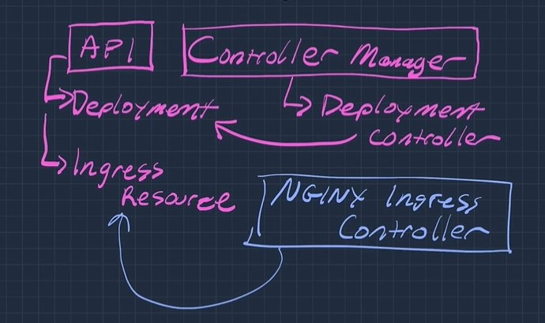

## Ingress
- kubernetes API resource, designed expose HTTP services
    ```
    kubectl get ingress
    ```
- features
    - load balancing
    - SSL termiation
    - name-based virtual hosting
    - route (ex /api -> api-service)

## Principle of operation
1. deploy an Ingress controller
    - Ingress controller = load balancing proxy + control loop
    - the control loop watches over Ingress resources and configures the LB accordingly
    - could be two separate process: NGINX server + NGINX Ingress controller
    - could be single app: Traefik
2. Set up DNS (usually)
    - associate external DNS entries with the load balancer or host address
3. Create Ingress resources for our Service resources
    - these resources contain rules handling HTTP/S connections
    - the Ingress controller picks up thses resources and configures the LB
    - connections to the Ingress LB will be processed by the rules

## Diagram

*There is no built-in Ingress controller*
